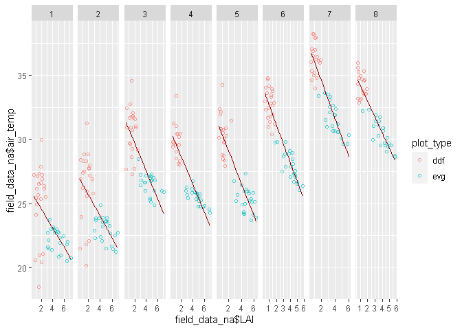

B4
================
Daniel
2023-12-02

## Strings and Functional Programming

This is the final STAT 545 porject of the semseter. I have selected
**Option A: Strings and Functional Programming in R** for my project.

### Exercise 1: Dissecting Frankenstein

For the first half of this project, in exercise 1, we will look at the
most common words in Mary Shelly’s Frankenstein by creating a word map.
This project will rely some map() from the purrr package, some regex,
and a lot of tidyverse.

Libraries

``` r
library(readr)
library(tidytext)
library(tidyverse)
library(stopwords)
library(broom)
library(tm)
```

First we load in Frankenstein.txt (source: [Project
Gutenburg](https://dev.gutenberg.org/ebooks/84)) using the read_lines()
function from the readr package

``` r
text <- read_lines ("Frankenstein.txt")
 
text_df <- data_frame(Text = text) 

#Converting txt into a tidy dataset with one word per row using unnest_tokens()
text_words <- text_df %>% 
  unnest_tokens(output = word, input = Text) 
```

Create function for removing stopwords (from the stopwords package) and
punctuation and numbers

``` r
cut_stopwords <- function(text) {
  text %>%
    removePunctuation() %>%
    removeNumbers() %>%
    removeWords(stopwords::stopwords())
}
```

Use purrr::map to preprocess the text using our new cut_stopwords
function

``` r
text_trimmed <- map(text_words, cut_stopwords)

#turning text_trimmed list into a tibble so I can work with it to get word counts
text_trimmed <- as_tibble(text_trimmed)

#cleaning out the empty rows with regex grepl() function so we don't count blanks
text_trimmed <- text_trimmed %>%
   filter_all(any_vars(!grepl("^\\s*$", .)))

#word count with the stopwords removed using count() function
word_count <- text_trimmed  %>% 
  count(word, sort = TRUE)
```

Everything looks good now with the word count, now to make a plot of the
top words

``` r
word_count %>%
  filter(n > 70) %>% 
  ggplot(aes(x = n, y = reorder(factor(word, levels = word_count$word), n)))+
  geom_col(fill = "darkslategray", color = "darkseagreen")+
  xlab("count") + ylab("word") + ggtitle("Most recurring words in Mary Shelly's Frankenstein")
```

<!-- -->

Love this book. Compared to other books that would be full of character
names, the only character directly mentioned here is Elizabeth who isn’t
even in the book all that much but surrounds a lot of the hostility that
Victor and the monster have for each other. The dichotomy of the words
in this list, “night” and “day” and “life” and “death” gives a lot of
insight into the duality of morals that is central to the book and to
the monster and even Victor’s attempts to reconcile with their own
existence and their actions.

### Exercise 3: Fitting multiple models with purrr

In my thesis data, I am interested in the relationship between 8 groups
of my response variable and one explanatory variable. Data was collected
periodically throughout the dry season, and each obs_period group
represents data collected later in the dry season. Rather than run each
relationship as a separate model, I will use the map family of functions
in the purrr package to apply a linear model to multiple columns
simultaneously.

First, I will read in my data

``` r
library(readr)
field_data <- read_csv("data/field_data.csv", 
    col_types = cols(date = col_date(format = "%m/%d/%Y"), 
        obs_period = col_character(), LAI = col_number(), 
        air_temp = col_number(), soil_moist = col_number()))
head(field_data)
```

    ## # A tibble: 6 × 10
    ##   plot_id date       obs_period   LAI plot_type quad_id month season air_temp
    ##   <chr>   <date>     <chr>      <dbl> <chr>     <chr>   <dbl> <chr>     <dbl>
    ## 1 evg2    2023-01-26 1           4.3  evg       q2          1 early      22.7
    ## 2 evg3    2023-01-26 1           7.25 evg       c           1 early      20.7
    ## 3 evg5    2023-01-26 1           6.62 evg       c           1 early      NA  
    ## 4 evg5    2023-01-26 1           6.6  evg       q1          1 early      22.0
    ## 5 evg3    2023-01-26 1           6.55 evg       q3          1 early      20.5
    ## 6 evg5    2023-01-26 1           6.45 evg       q3          1 early      21.8
    ## # ℹ 1 more variable: soil_moist <dbl>

Okay, data is in. I have averages for the explanatory variable: canopy
cover (represented as LAI) for each observation period. Each
obeservation period spans one to two weeks over the course of a season
and I am curious how the relationship between canopy cover (LAI) and air
temperature changed with each observation period. I expect the
relationship to be linear so I will be fitting linear models across all
8 obs_period groups, using the purrr package to model them all at once.

First, I will nest the field data into tibbles of my grouping variable
(obs_period), and then use mutate() on the nested data to run the lm()
function with map() across all obs periods to get lists for the model
outputs of the relationship between LAI and air_temp.

``` r
field_data_na <- na.omit(field_data)


# '~' defines anonymous function and '.' serves as placeholder for the function argument.
data_model <- field_data_na %>% 
  group_by(obs_period) %>% 
  nest() %>% 
  mutate(
    model = map(data, ~lm(data =., air_temp ~ LAI)),  
    coeffs = map(model, coefficients),
    preds = map(model, augment)
  )

list(data_model)
```

    ## [[1]]
    ## # A tibble: 8 × 5
    ## # Groups:   obs_period [8]
    ##   obs_period data              model  coeffs    preds            
    ##   <chr>      <list>            <list> <list>    <list>           
    ## 1 1          <tibble [46 × 9]> <lm>   <dbl [2]> <tibble [46 × 8]>
    ## 2 2          <tibble [46 × 9]> <lm>   <dbl [2]> <tibble [46 × 8]>
    ## 3 3          <tibble [45 × 9]> <lm>   <dbl [2]> <tibble [45 × 8]>
    ## 4 4          <tibble [40 × 9]> <lm>   <dbl [2]> <tibble [40 × 8]>
    ## 5 5          <tibble [43 × 9]> <lm>   <dbl [2]> <tibble [43 × 8]>
    ## 6 6          <tibble [45 × 9]> <lm>   <dbl [2]> <tibble [45 × 8]>
    ## 7 7          <tibble [43 × 9]> <lm>   <dbl [2]> <tibble [43 × 8]>
    ## 8 8          <tibble [42 × 9]> <lm>   <dbl [2]> <tibble [42 × 8]>

I am interested in comparing the slopes and intercepts between all of
the observation periods, so I can use map_dbl() to extract the second
element (slope) from the coefficients column. I will call slope via
indexing and intercept by name using quotes “” just for practice.

``` r
data_model %>% 
  mutate(slope = map_dbl(coeffs, 2)) %>% 
    mutate(Intercept = map_dbl(coeffs, "(Intercept)"))
```

    ## # A tibble: 8 × 7
    ## # Groups:   obs_period [8]
    ##   obs_period data              model  coeffs    preds     slope Intercept
    ##   <chr>      <list>            <list> <list>    <list>    <dbl>     <dbl>
    ## 1 1          <tibble [46 × 9]> <lm>   <dbl [2]> <tibble> -0.753      26.1
    ## 2 2          <tibble [46 × 9]> <lm>   <dbl [2]> <tibble> -0.842      27.4
    ## 3 3          <tibble [45 × 9]> <lm>   <dbl [2]> <tibble> -1.09       31.9
    ## 4 4          <tibble [40 × 9]> <lm>   <dbl [2]> <tibble> -1.05       30.6
    ## 5 5          <tibble [43 × 9]> <lm>   <dbl [2]> <tibble> -1.27       31.6
    ## 6 6          <tibble [45 × 9]> <lm>   <dbl [2]> <tibble> -1.48       34.1
    ## 7 7          <tibble [43 × 9]> <lm>   <dbl [2]> <tibble> -1.51       37.6
    ## 8 8          <tibble [42 × 9]> <lm>   <dbl [2]> <tibble> -1.23       35.4

Alternatively, we can use the broom() package to pull all of the data
from the model lists: here we can see estimate, standard errors and
p-values for slopes and intercepts. We will remove the unnecessary
columns with the nested information to view the helpful model data.

``` r
data_model %>%
  mutate(coef = map(model, tidy)) %>%
  unnest(coef) %>% 
   select(-data, -model, - coeffs, -preds)
```

    ## # A tibble: 16 × 6
    ## # Groups:   obs_period [8]
    ##    obs_period term        estimate std.error statistic  p.value
    ##    <chr>      <chr>          <dbl>     <dbl>     <dbl>    <dbl>
    ##  1 1          (Intercept)   26.1      0.676      38.6  1.49e-35
    ##  2 1          LAI           -0.753    0.184      -4.09 1.79e- 4
    ##  3 2          (Intercept)   27.4      0.644      42.5  2.21e-37
    ##  4 2          LAI           -0.842    0.173      -4.86 1.54e- 5
    ##  5 3          (Intercept)   31.9      0.478      66.6  4.94e-45
    ##  6 3          LAI           -1.09     0.135      -8.08 3.63e-10
    ##  7 4          (Intercept)   30.6      0.331      92.4  2.43e-46
    ##  8 4          LAI           -1.05     0.0887    -11.9  2.49e-14
    ##  9 5          (Intercept)   31.6      0.401      78.9  2.09e-46
    ## 10 5          LAI           -1.27     0.109     -11.7  1.36e-14
    ## 11 6          (Intercept)   34.1      0.298     114.   4.42e-55
    ## 12 6          LAI           -1.48     0.0969    -15.3  5.03e-19
    ## 13 7          (Intercept)   37.6      0.360     105.   2.12e-51
    ## 14 7          LAI           -1.51     0.121     -12.5  1.43e-15
    ## 15 8          (Intercept)   35.4      0.264     134.   1.06e-54
    ## 16 8          LAI           -1.23     0.0849    -14.5  1.63e-17

From the broom() sweep we can see that all of the relationships are
significant, but I would like to visualize how the relationships differ
in slope.

We will get the predictions from the “preds” column created in the
original nested dataset using the map(function) and broom’s augment. I
will plot the data points with the original data and evaluate the slopes
from our predictions represented as trend lines.

``` r
unnested_preds <- 
  data_model %>% 
  unnest(preds)

unnested_preds 
```

    ## # A tibble: 350 × 12
    ## # Groups:   obs_period [8]
    ##    obs_period data     model  coeffs air_temp   LAI .fitted .resid   .hat .sigma
    ##    <chr>      <list>   <list> <list>    <dbl> <dbl>   <dbl>  <dbl>  <dbl>  <dbl>
    ##  1 1          <tibble> <lm>   <dbl>      22.7  4.3     22.8 -0.129 0.0298   2.24
    ##  2 1          <tibble> <lm>   <dbl>      20.7  7.25    20.6  0.118 0.134    2.24
    ##  3 1          <tibble> <lm>   <dbl>      22.0  6.6     21.1  0.940 0.100    2.24
    ##  4 1          <tibble> <lm>   <dbl>      20.5  6.55    21.1 -0.607 0.0981   2.24
    ##  5 1          <tibble> <lm>   <dbl>      21.8  6.45    21.2  0.590 0.0936   2.24
    ##  6 1          <tibble> <lm>   <dbl>      22.5  5.84    21.7  0.804 0.0690   2.24
    ##  7 1          <tibble> <lm>   <dbl>      21.0  5.41    22.0 -1.02  0.0548   2.24
    ##  8 1          <tibble> <lm>   <dbl>      22.3  5.31    22.1  0.244 0.0518   2.24
    ##  9 1          <tibble> <lm>   <dbl>      21.9  5.24    22.1 -0.199 0.0499   2.24
    ## 10 1          <tibble> <lm>   <dbl>      20.8  5.05    22.3 -1.44  0.0448   2.23
    ## # ℹ 340 more rows
    ## # ℹ 2 more variables: .cooksd <dbl>, .std.resid <dbl>

``` r
ggplot(field_data_na, aes(x = field_data_na$LAI, y = field_data_na$air_temp)) +
   geom_point(aes(color = plot_type), alpha = 0.7, shape = 1) +
   facet_grid(. ~ obs_period, scales = "free") +
   geom_line(data = unnested_preds, aes(y = .fitted, LAI), color = "darkred")
```

<!-- --> \#### Results:

We see a slightly increasing slope as the season progresses, but
generally the negative trend is comparable. Observation 1 and 2 have
outliers that appear to fall in line with the rest of the data as the
year progresses, so I will need to look into those further, perhaps one
of the ddf (open canopy) plots are particularly in the early dry season.
We see an increase in overall temperature, represented by the increasing
intercepts, as the dry season progresses with a peak at observation 7.
